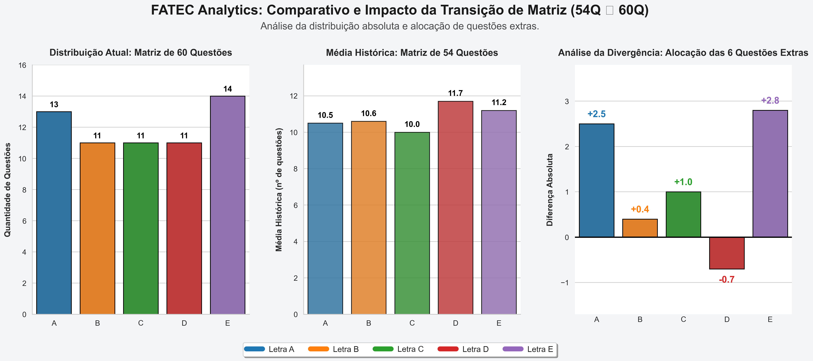
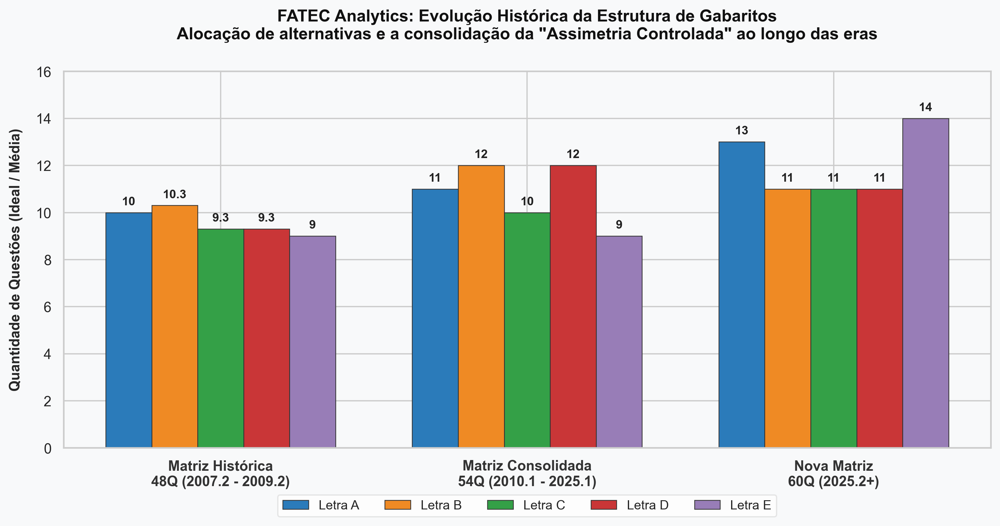

# 📊 FATEC Exam Analytics: Reverse Engineering & Predictive Modeling


## 📌 1. Executive Summary & Business Problem
Testes padronizados de múltipla escolha não são avaliações puramente de conhecimento; eles são sistemas probabilísticos complexos. Para garantir a integridade do exame e mitigar a taxa de sucesso de técnicas baseadas em probabilidade cega (o "chute" estatístico), bancas examinadoras desenvolvem algoritmos proprietários de distribuição de alternativas.

Este projeto aplica técnicas de **Data Analytics, Engenharia Reversa e Estatística Descritiva** sobre o histórico do Vestibular da FATEC (Faculdade de Tecnologia de São Paulo). O objetivo primário é auditar a matriz de respostas da banca, identificar os vieses de "Assimetria Controlada" inseridos intencionalmente no sistema e desenvolver uma heurística preditiva para otimização de tomada de decisão em cenários de tempo esgotado.

---

## 🏗️ 2. Arquitetura de Dados e Pipeline ETL
Para garantir a confiabilidade matemática da análise, os dados brutos passaram por um pipeline rigoroso de *Extract, Transform, Load* (ETL):

* **Data Extraction:** Coleta manual/automatizada de espelhos de gabaritos oficiais das edições históricas.
* **Data Wrangling & Transformation:** Normalização de dados não-estruturados em um esquema relacional (DataFrames estruturados no formato Tidy Data).
* **Data Validation (Integrity Checks):** Criação de testes de sanidade garantindo que a soma das alternativas (A, B, C, D, E) seja estritamente igual ao Total de Questões para cada registro, eliminando ruídos ou falhas de transcrição.

### 2.1. Cohort Segmentation (Agrupamento Temporal)
O comportamento da banca não é estático; ele evolui. Para evitar contaminação estatística, o *dataset* foi isolado em três *cohorts* de formato de prova:
1. **Cohort Legacy (48 Questões | 2007.2 - 2009.2):** A fase embrionária do exame.
2. **Cohort Standard (54 Questões | 2010.1 - 2025.1):** A "Moda Estatística" e o *core* das nossas análises de variância (15 anos de estabilidade).
3. **Cohort Expansion (60 Questões | 2025.2 - Atual):** A nova matriz curricular e comportamental da banca.

---

## 📉 3. O Gênesis do Algoritmo: Cohort Legacy (48Q)


A análise da matriz histórica revela o comportamento primitivo da banca. O "Muro Simétrico" demonstrava uma forte intenção de equilibrar a prova, mas com um viés estatístico claro: as alternativas iniciais (A e B) frequentemente acumulavam desvios positivos (arredondamento para cima), enquanto a alternativa **E** sofria a maior penalização do período, atuando como descarte.

---

## 📈 4. Dashboard Analítico: Cohort Standard (54Q)


Na era de ouro da estabilidade (15 anos), a visualização acima utiliza *barplots* para contrapor o **Modelo de Gabarito Ideal** contra o **Raio-X de Evolução Empilhada**, permitindo a detecção imediata de *outliers* (pontos fora da curva) e a visualização do volume estrito de cada alternativa ao longo do tempo.

### 4.1. Deep Dive: A Psicologia do Algoritmo (54Q)
A análise exploratória (EDA) permitiu classificar o comportamento de cada alternativa sob a ótica de desvio padrão e risco:

* 🟢 **Letra C (A "Âncora Estatística"):** Atua como o centro de gravidade do modelo e prova de sanidade do exame. Possui o menor Desvio Padrão do conjunto, ancorando-se na marca de **10 respostas corretas** na grande maioria da série histórica.
* 🔵 **Letra A (A "Baseline Silenciosa"):** Historicamente discreta, funciona como um preenchimento seguro e de baixa variância (oscilando entre 9 e 11 respostas).
* 🟠 **Letra B (O "Honeypot" Punitivo):** Durante anos operou com alto volume (11 a 12 pontos). Contudo, a análise de série temporal detectou um *Crash Point* algorítmico nas safras 2024.1 e 2024.2, onde a banca cortou sua presença para **apenas 5 respostas**. Conclusão: a banca programa quebras abruptas para punir "chutes" padronizados em opções seguras.
* 🔴 **Letra D (O "Gatilho de Caos"):** É o vetor de volatilidade intencional. Quando a banca projeta um exame para maximizar a dificuldade probabilística, despeja um volume massivo de gabaritos na letra D, registrando picos anômalos de **15 a 17 ocorrências**.
* 🟣 **Letra E (O "Pêndulo de Compensação"):** Funciona como a variável dependente do sistema, absorvendo o "troco" das outras alternativas. Gera uma distribuição binária: escassez absoluta (7 a 8) ou inundação do cartão (até 14 respostas).

---

## 🚀 5. O Impacto da Transição: Cohort Expansion (60Q)



Ao ganhar 6 questões extras a partir do semestre 2025.2, a banca não buscou um equilíbrio matemático perfeito de 12 questões por alternativa. A Análise de Divergência prova que as 6 novas alocações foram jogadas estrategicamente para os polos do exame. O miolo (B, C, D) estagnou, enquanto as Letras **A (+2.5)** e **E (+2.8)** explodiram em volume.

---

## 🔄 6. A Linha do Tempo da "Assimetria Controlada"



Este painel consolida as três eras da FATEC, comprovando de forma visual a evolução algorítmica:
* **Matriz 48Q:** Simetria rudimentar e previsível.
* **Matriz 54Q:** Introdução de variâncias agressivas (D) e âncoras (C) para quebrar o padrão.
* **Nova Matriz 60Q:** Congelamento do "miolo" em exatas 11 ocorrências por letra e alocação do peso estatístico nas extremidades do gabarito (A e E), selando o padrão de **Assimetria Controlada**.

---

## 🔮 7. Forecasting: Cenários Preditivos para Otimização de Risco
Transformando dados em inteligência de decisão. Frente ao cenário restrito do vestibular, o *risk management* em chutes deve considerar a realidade atual (Nova Matriz 60Q):

1. **A Nova Fronteira de Segurança (Polos A e E):** Com a nova estruturação, as alternativas A (13) e E (14) assumiram o topo da cadeia probabilística. Juntas representam quase 45% do gabarito. Se houver deficiência de marcações nessas letras no final da prova, elas são estatisticamente os melhores alvos.
2. **O Miolo Restrito (B, C, D):** O limite dessas alternativas foi tencionado para um teto estrito de 11 questões. Ultrapassar marcações conscientes de 13 ou 14 letras C ou D na prova atual indica uma altíssima probabilidade de que o candidato caiu em armadilhas (distratores) da banca examinadora.

---

## 💻 8. Reproducibilidade & Estrutura do Projeto

### Pré-requisitos (Ambiente de Desenvolvimento)
* Python 3.8+
* Gestão de dependências via `pip` ou ambiente virtual (`venv` / `conda`).

```bash
# Clone o repositório
git clone [https://github.com/caiiobuenoo/fatec-analise-gabaritos.git](https://github.com/caiiobuenoo/fatec-analise-gabaritos.git)

# Acesse o diretório
cd fatec-analise-gabaritos

# Instale as bibliotecas de Data Science requeridas
pip install pandas matplotlib seaborn numpy

# Execute os scripts de visualização (Exemplo)
python analise_fatec_60q_master.py
