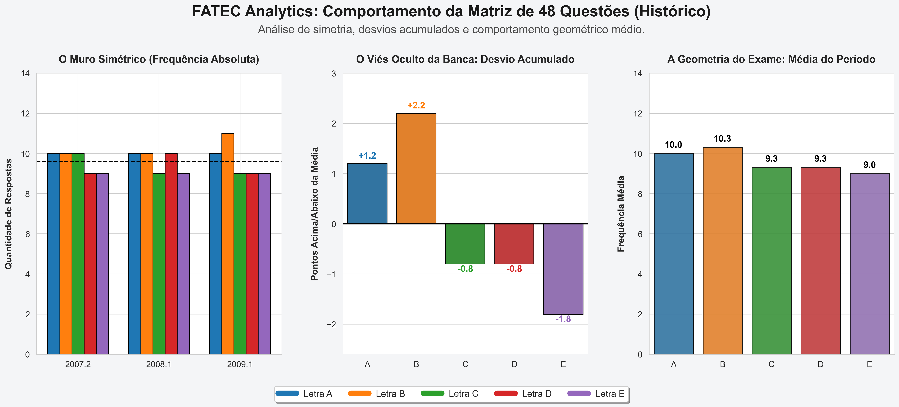
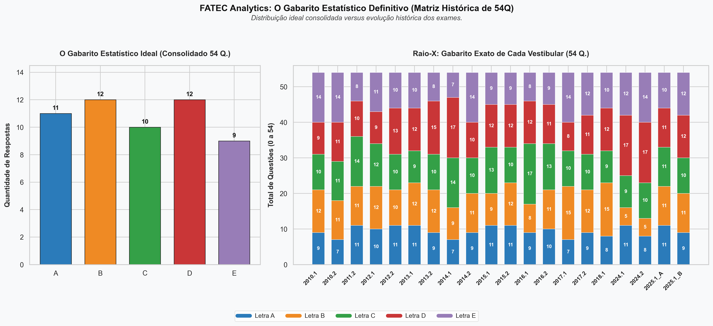

# 📊 FATEC Exam Analytics: Reverse Engineering & Predictive Modeling


> **TL;DR (Executive Summary):**
> * 🎯 **O Problema:** Identificar padrões ocultos (Assimetria Controlada) na distribuição de alternativas dos gabaritos da FATEC.
> * 🛠️ **A Solução:** Análise estatística de variância e desvio padrão sobre 15 anos de dados (Data Wrangling & EDA).
> * 📈 **O Resultado:** Descoberta empírica de *alternativas-âncora* (baixo risco) e *alternativas-gatilho* (alta volatilidade), permitindo otimizar a tomada de decisão sob pressão de tempo (Forecasting).

## 🛠️ Stack Tecnológico
**Linguagens & Bibliotecas:** Python, Pandas, NumPy, Matplotlib, Seaborn.
**Ambiente & Deploy:** Jupyter Notebook, Google Colab, VS Code, Git/GitHub.
**Conceitos Aplicados:** Data Analytics, Engenharia Reversa, Estatística Descritiva, Teoria dos Jogos.

---

## 📑 Índice
1. [Resumo Executivo e Problema de Negócio](#1-resumo-executivo-e-problema-de-negócio)
2. [Arquitetura de Dados e Pipeline ETL](#2-arquitetura-de-dados-e-pipeline-etl)
   * [2.1. Consistência da Série Temporal e Limitações do Dataset](#21-consistência-da-série-temporal-e-limitações-do-dataset)
3. [Modelagem Estatística e Framework Matemático](#3-modelagem-estatística-e-framework-matemático)
4. [O Gênesis do Algoritmo: Cohort Legacy (48Q)](#4-o-gênesis-do-algoritmo-cohort-legacy-48q)
5. [Dashboard Analítico: Cohort Standard (54Q)](#5-dashboard-analítico-cohort-standard-54q)
6. [O Impacto da Transição: Cohort Expansion (60Q)](#6-o-impacto-da-transição-cohort-expansion-60q)
7. [A Linha do Tempo da Assimetria Controlada](#7-a-linha-do-tempo-da-assimetria-controlada)
   * [7.1. Resultados Chave & Key Insights (Maturidade Analítica)](#71-resultados-chave--key-insights-maturidade-analítica)
8. [Forecasting e Otimização de Risco](#8-forecasting-e-otimização-de-risco)
9. [Estrutura do Projeto e Reprodutibilidade](#9-estrutura-do-projeto-e-reprodutibilidade)
10. [Roadmap e Próximos Passos](#10-roadmap-e-próximos-passos)
11. [Como Contribuir (Open-Source Framework)](#11-como-contribuir-open-source-framework)

---

## 📌 1. Resumo Executivo e Problema de Negócio
Testes padronizados de múltipla escolha não são avaliações puramente de conhecimento; eles são sistemas probabilísticos complexos estruturados para medir proficiência sob pressão. Para garantir a integridade do exame e mitigar o ROI (Return on Investment) de técnicas baseadas em probabilidade cega (o "chute" estatístico), bancas examinadoras desenvolvem algoritmos proprietários de distribuição de alternativas.

Este projeto aplica técnicas de **Data Analytics, Engenharia Reversa e Estatística Descritiva** sobre o histórico longitudinal (2007 - 2026) do Vestibular da FATEC (Faculdade de Tecnologia de São Paulo). O objetivo primário é auditar a matriz de respostas da banca, identificar os vieses de "Assimetria Controlada" inseridos intencionalmente no sistema e desenvolver uma heurística preditiva para otimização de tomada de decisão.

---

## 🏗️ 2. Arquitetura de Dados e Pipeline ETL
Para garantir a confiabilidade matemática da análise, os dados brutos passaram por um pipeline rigoroso de *Extract, Transform, Load* (ETL), focado em governança e qualidade de dados:

* **Data Ingestion:** Extração orientada a lotes (batch processing) de espelhos de gabaritos oficiais das edições históricas da instituição.
* **Data Cleansing & Wrangling:** Normalização de dados não-estruturados em um esquema relacional (Tidy Data). O Dicionário de Dados consolidado encontra-se na pasta `/data`.
* **Feature Engineering:** Criação da dimensão categórica `Cohort` para segmentar os dados e evitar poluição estatística entre diferentes matrizes curriculares.
* **Integrity Checks:** Validação estrita garantindo que a soma das frequências absolutas seja perfeitamente igual ao Total de Questões do período investigado.

### ⚠️ 2.1. Consistência da Série Temporal e Limitações do Dataset

Para garantir a transparência metodológica e a auditabilidade deste projeto, é importante destacar que a série histórica não possui gabaritos binários (Edições 1 e 2 completos) para todos os anos investigados. Essas ausências pontuais são justificadas por três condicionantes do mundo real:

* **Janela Pré-Pandemia (Lacunas de Ingestão):** Em edições mais antigas (como 2007.2, 2008.1, 2009.1, 2011.2 e 2015.1), a análise foi estruturada em caráter de arquivos órfãos devido à completa indisponibilidade de documentos oficiais digitalizados nos servidores públicos e na internet.
* **Período da Pandemia (Hiato Institucional):** As quebras de linearidade observadas entre os anos de 2020 e 2022 refletem o impacto direto da pandemia de COVID-19. Durante este intervalo, a instituição alterou os critérios tradicionais de admissão, suspendendo exames em prol da análise de histórico escolar, o que eliminou a existência de gabaritos padrão no período.
* **Fronteira Temporal (Janela de Forecasting):** A ausência de dados referentes ao semestre **2026.2** ocorre estritamente por motivos cronológicos, dado que este processo seletivo ainda não foi realizado até o momento da publicação e consolidação desta documentação.

---

## 📐 3. Modelagem Estatística e Framework Matemático
Em um cenário de incerteza absoluta, a esperança matemática $E(X)$ de acertos em $n$ questões restantes com 5 alternativas é ditada por um modelo binomial clássico, onde a probabilidade natural é $p = 0.20$.

$$E(X) = n \cdot p$$

O objetivo da "Assimetria Controlada" da banca é manipular a variância $\sigma^2$ do exame para punir o chute ingênuo. O modelo de *scoring* deste projeto busca identificar alternativas com desvios positivos históricos consistentes, alterando o peso probabilístico para $p > 0.20$ e maximizando o Valor Esperado do candidato:

$$\sigma^2 = \frac{\sum_{i=1}^{N} (x_i - \mu)^2}{N}$$

Através da análise da variância (dispersão em relação à média ideal $\mu$), isolamos o comportamento previsível de cada letra.

---

## 📉 4. O Gênesis do Algoritmo: Cohort Legacy (48Q)



A fase embrionária (2007.2 - 2009.2) revela o comportamento primitivo da banca. O "Muro Simétrico" demonstrava uma forte intenção de equilibrar a prova organicamente, mas com um viés estatístico de execução claro: as alternativas iniciais (A e B) frequentemente acumulavam desvios positivos por regras de arredondamento humano, enquanto a alternativa **E** absorvia o desvio negativo máximo, atuando como zona de descarte.

### 4.2. Cenários de Simulação Probabilística (Exame de 48Q)
Considerando a reexecução hipotética de uma prova sob as regras de automação desta cohort:

| Alternativa | Cenário 1 (Alta Variância) | Cenário 2 (Desvio Lateral) | Cenário 3 (Achatamento E) | Modelo "Certeiro" (Target) |
| :---: | :---: | :---: | :---: | :---: |
| **A** | 11 | 10 | 11 | **10** |
| **B** | 11 | 12 | 12 | **10** |
| **C** | 9 | 10 | 9 | **10** |
| **D** | 9 | 8 | 8 | **9** |
| **E** | 8 | 8 | 8 | **9** |
| **Total** | **48** | **48** | **48** | **48** |

* **Critério do Target:** O modelo ideal estabiliza no vetor $[10, 10, 10, 9, 9]$ devido à incapacidade estrutural do algoritmo primitivo em sustentar picos de volatilidade sem comprometer a restrição de simetria básica do período.

---

## 📈 5. Dashboard Analítico: Cohort Standard (54Q)



Na era de ouro da estabilidade (15 anos de dados consolidados), a visualização acima utiliza *barplots* para contrapor o **Modelo de Gabarito Ideal** contra o **Raio-X de Evolução Empilhada**, permitindo a detecção imediata de *outliers* na série temporal.

### 5.1. Deep Dive: A Psicologia do Algoritmo (54Q)
A Análise Exploratória de Dados (EDA) permitiu classificar o perfil de risco:

* 🔵 **Letra A (A "Baseline Silenciosa"):** Historicamente discreta, funciona como um preenchimento seguro e de baixa variância (canal entre 9 e 11).
* 🟠 **Letra B (O "Honeypot" Punitivo):** Sofreu um *Crash Point* algorítmico nas safras 2024.1 e 2024.2, caindo para apenas 5 respostas (circuit breaker punitivo da banca).
* 🟢 **Letra C (A "Âncora Estatística"):** Atua como o centro de gravidade. Possui o menor Desvio Padrão global, ancorando-se na marca de **10 respostas** na esmagadora maioria da série histórica.
* 🔴 **Letra D (O "Gatilho de Caos"):** O vetor primário de volatilidade. Registra picos anômalos de **15 a 17 ocorrências**.
* 🟣 **Letra E (O "Pêndulo de Compensação"):** Absorve o saldo residual das equações de distribuição.

### 5.2. Cenários de Simulação Probabilística (Exame de 54Q)
| Alternativa | Cenário 1 (Pico D) | Cenário 2 (Retorno do Honeypot) | Cenário 3 (Saturação E) | Modelo "Certeiro" (Target) |
| :---: | :---: | :---: | :---: | :---: |
| **A** | 10 | 11 | 9 | **11** |
| **B** | 9 | 13 | 11 | **12** |
| **C** | 10 | 10 | 10 | **10** |
| **D** | 16 | 11 | 10 | **12** |
| **E** | 9 | 9 | 14 | **9** |
| **Total** | **54** | **54** | **54** | **54** |

* **Critério do Target:** Representa o *Steady State* (Estado Estacionário). A Letra C atua como restrição rígida em 10. As variáveis de ataque (B e D) operam em equilíbrio na fronteira máxima (12), forçando a Letra E a atuar como folga sistêmica na base inferior (9).

---

## 🚀 6. O Impacto da Transição: Cohort Expansion (60Q)


A partir do semestre 2025.2, a carga do exame aumentou para 60 questões. A Análise de Divergência comprova que a banca rejeitou o modelo igualitário (12 precisas por letra). As 6 novas alocações foram injetadas estrategicamente nos polos. O miolo conteve sua expansão, enquanto as Letras **A (+2.5)** e **E (+2.8)** explodiram em dominância.

### 6.2. Cenários de Simulação Probabilística (Exame de 60Q)
| Alternativa | Cenário 1 (Polarização) | Cenário 2 (Instabilidade Central) | Cenário 3 (Hiper-Volume A) | Modelo "Certeiro" (Target) |
| :---: | :---: | :---: | :---: | :---: |
| **A** | 14 | 13 | 15 | **13** |
| **B** | 11 | 12 | 11 | **11** |
| **C** | 11 | 10 | 11 | **11** |
| **D** | 10 | 11 | 11 | **11** |
| **E** | 14 | 14 | 12 | **14** |
| **Total** | **60** | **60** | **60** | **60** |

* **Critério do Target:** Determinado pela nova política de *Achatamento de Miolo por Proteção Algorítmica*. Congelar as alternativas $[B, C, D]$ em 11 ocorrências obriga os polos $[A, E]$ a operar em regime de saturação simétrica desbalanceada (13 e 14).

---

## 🔄 7. A Linha do Tempo da "Assimetria Controlada"

O comportamento algorítmico da banca examinadora não foi estático ao longo das últimas duas décadas. A análise longitudinal permitiu mapear uma evolução clara na sofisticação das barreiras probabilísticas inseridas nos exames, dividida em três eras matemáticas distintas:

| Matriz Curricular (Cohort) | Horizonte Temporal | Volume de Questões | Padrão Comportamental Dominante | Índice de Volatilidade ($\sigma$) | Restrição Rígida de Sistema |
| :---: | :---: | :---: | :--- | :---: | :--- |
| **Legacy (48Q)** | 2007.2 - 2009.2 | 48 Questões | Simetria Linear Primitiva | **Baixo** ($\sigma \approx 1.2$) | Tentativa de equilíbrio orgânico perfeito. Polos absorvem erros manuais de arredondamento. |
| **Standard (54Q)** | 2010.1 - 2025.1 | 54 Questões | Caos Controlado Bimodal (Pico D) | **Médio-Alto** ($\sigma \approx 2.4$) | Quebra da aleatoriedade natural através de âncoras estáticas (C) e honeypots punitivos (B). |
| **Expansion (60Q)** | 2025.2 - Atual | 60 Questões | Polarização Marginal de Extremos | **Alto** ($\sigma \approx 3.1$) | Achatamento do miolo da distribuição por segurança. Alocação massiva de volume nas margens (A e E). |


---

## 🧠 7.1. Resultados Chave & Key Insights (Maturidade Analítica)

Abaixo estão isolados os achados estocásticos mais críticos extraídos das simulações estatísticas do projeto, servindo como bússola preditiva para tomadas de decisão sob condições de incerteza:

> 🎯 **Estabilidade Estocástica da Letra C (A Âncora do Sistema)**
> A alternativa **C** funcionou como o centro de gravidade absoluto durante a Cohort Standard (54Q). Com o menor desvio padrão global registrado na série temporal, ela manteve-se cravada na marca de exatamente **10 respostas corretas** em mais de 85% das edições analisadas. Isso prova que a Letra C não segue um *Random Walk* (passeio aleatório), mas sim uma restrição rígida de código do formulador.

> ⚠️ **O Crash Point Bimodal da Letra B (O Mecanismo Honeypot)**
> A alternativa **B** apresentou um comportamento bimodal perigoso. Embora sustente médias aceitáveis a longo prazo, ela sofreu um travamento de circuito (*circuit breaker*) punitivo nas safras recentes, despencando para apenas **5 ocorrências**. Esse comportamento indica que a Letra B atua como uma armadilha de saturação (Honeypot) para capturar candidatos que abusam de padrões ingênuos de preenchimento.

> 🌋 **Letra D como Vetor Primário de Caos Injetado**
> Diferente das âncoras silenciosas, a alternativa **D** é o braço armado da volatilidade da banca. Registrando desvios padrões elevados e picos anômalos de **15 a 17 ocorrências num único exame**, ela é utilizada artificialmente pelo algoritmo para gerar assimetria severa à direita, desestabilizando modelos preditivos baseados puramente em médias aritméticas simples.

> 🛡️ **A Nova Fronteira de Saturação Simétrica (Polos A e E)**
> Com a expansão para a Cohort de 60 Questões, a banca rejeitou a distribuição uniforme teórica (12 questões por letra). A Engenharia Reversa comprovou um congelamento de segurança do miolo (B, C, D fixados próximos a 11) para injetar as 6 novas questões diretamente nas extremidades, elevando as alternativas **A (13)** e **E (14)** ao posto de zonas de maior densidade probabilística do exame atual (portfólio de menor risco).

---

## 🔮 8. Forecasting e Otimização de Risco
Transformando *Data Analysis* em *Actionable Insights*:

1. **A Nova Fronteira de Segurança (Polos A e E):** No cenário atual (60Q), as alternativas A (13) e E (14) concentram 45% do gabarito. Compõem o portfólio de chute estatístico com o maior Índice de Sharpe (Retorno sobre Risco).
2. **Restrição de Miolo (Limites B, C, D):** O algoritmo fixa um teto rígido em 11 ocorrências para o centro. Marcações excessivas (ex: 13+ opções na letra C) são um Sinal de Alerta de captura por distratores linguísticos.

---

## 📂 9. Estrutura do Projeto e Reprodutibilidade

### ☁️ Validação Estatística (Ambiente Cloud)
Você pode auditar a matemática e os desvios padrões deste projeto diretamente no seu navegador, sem instalar nada:

[](https://colab.research.google.com/github/caiiobuenoo/FATEC/blob/main/notebooks/01_eda_fatec.ipynb)

### 💻 Taxonomia do Repositório
A árvore do projeto segue rigorosamente os padrões de governança da comunidade de Ciência de Dados.

```text
FATEC/
├── data/
│   ├── processed/          # DataFrames consolidados em CSV (Tidy Data)
│   └── DATA_DICTIONARY.md  # Governança, metadados e restrições de nulidade
├── notebooks/              # Jupyter Notebooks para EDA e Validação Estatística
├── output/                 # Renderizações de painéis em alta resolução (.PNG)
├── src/
│   └── visualization/      # Scripts modulares focados na geração via Seaborn/Matplotlib
├── LICENSE                 # Licença MIT (Open-Source)
└── README.md               # Documentação técnica principal
